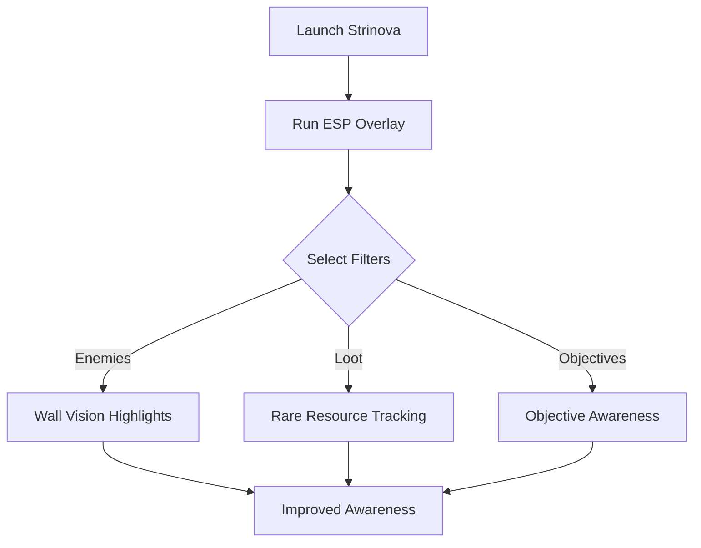

# Strinova ESP Overlay 👁 for Enemy Vision & Tactical Awareness

In *Strinova*, survival isn’t just about damage—it’s about information. The **Strinova ESP Overlay tool** gives you real-time vision of enemies, loot, and objectives, ensuring you always know what’s happening around you. Whether navigating dungeons or clashing in PvP, this tool maximizes your situational awareness.

[](#)
[](#)
[](#)
[](#)

---

## 🧭 Overview

Instead of reacting late, ESP overlays reveal threats and opportunities before they reach you. Configure filters to highlight only what matters: rival players, NPCs, rare resources, or strategic points of interest. Clean rendering keeps your screen clear while giving you critical data in the heat of combat.

---

## ⭐ Features

* **Enemy ESP** – Outline rival players and NPCs through walls and terrain.
* **Loot & Resource Highlights** – Track rare drops, crafting mats, or supply crates.
* **Objective Awareness** – Mark capture points and dungeon targets.
* **Distance Scaling** – Fade distant overlays for clarity.
* **Customizable Filters** – Choose which categories appear on-screen.

[!WARNING]
Activating too many overlay filters may clutter your HUD—use balanced presets for best visibility.

---

## 🖥 Compatibility

| Platform      | Status          | Notes                    |
| ------------- | --------------- | ------------------------ |
| Windows 10/11 | ✅ Full Support  | Stable overlay rendering |
| Steam Deck    | ⚠️ Partial      | Scaling may be limited   |
| Consoles      | ❌ Not Supported | PC-only version          |

---

## ⚡ Setup Guide

1. Download the Strinova ESP Overlay package.
2. Extract to a secure folder.
3. Run with administrator permissions:

   ```bash
   StrinovaESP.exe --start
   ```
4. Adjust your preferences in `esp_config.json`:

   ```json
   {
     "show_enemies": true,
     "show_loot": true,
     "show_objectives": false,
     "max_distance": 450
   }
   ```
5. Launch *Strinova* and toggle overlays in-game using hotkeys.

---

## 🌀 ESP Workflow Diagram



---

## ❓ FAQ

**Q: Does ESP lower FPS?**
A: No, it’s lightweight and optimized for stability.

**Q: Can I highlight only specific loot?**
A: Yes, the config allows rarity-based filters.

**Q: Does it work for PvE and PvP?**
A: Yes, overlays adapt to both seamlessly.

**Q: Can I disable overlays instantly?**
A: Yes, hotkey toggles allow quick control.

**Q: How often is it updated?**
A: Updates follow Strinova’s patch releases.

---

## 🚀 Final Thoughts

The **Strinova ESP Overlay** ensures you see threats and opportunities before anyone else. With customizable filters and optimized rendering, it’s the ultimate tactical tool for adventurers seeking awareness in every encounter.

---
